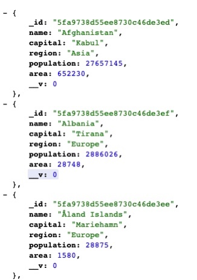

## API-Project-6
Countries API built using a Rest API. The data contains name, capital, region, population, and Area. Using this API you may read, create, update, and delete information.

## Sample Data

## Api Routes Documentation
GET - "/" Route gives you all information.

GET - "/:id" Route vives you specific country by ID

GET - "/name/:name" Search by name

POST - "/" You may create another country or information

POST - "/:id" Update item by ID

DELETE - "/:id" Delete item by ID

## Usage
Fork and clone, CD into new directory.

## Technologies used
Node, MongoDB, Express, Mongoose, Javascript
